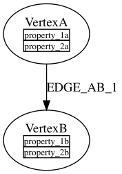
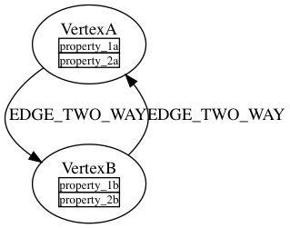
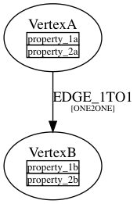
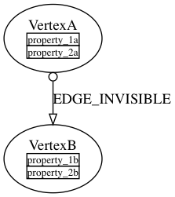
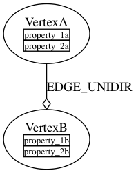
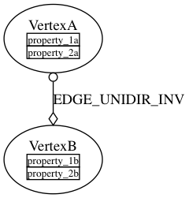
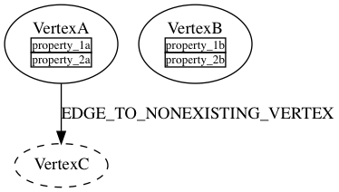
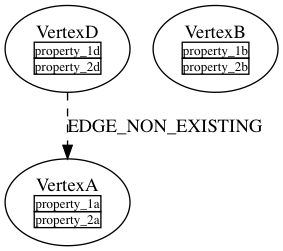
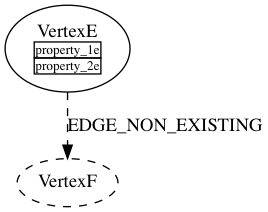
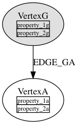

# Graph schema visualization with GraphViz


A primitive DOT file is generated (graph.dot) along with the documentation. You can visualize it using GraphViz. You can download the software from [http://www.graphviz.org](http://www.graphviz.org)


When you generate the documentation, a file called "graph.dot" is generated int he same directory. You can use "dot" tool to convert this file into something viewable. The following command will convert it to PDF and feed it straight to the Preview app on Mac:


```
dot -Tpdf generated-docs/graph.dot  | open -f -a /Applications/Preview.app
```

Generating images:

```
dot -Tpng graph.dot > graph.png

dot -Tsvg graph.dot > graph.svg

```

## Limitations

The schema manager converts the schema definition into a graph based on the definitions of the vertices, edges and, most importantly, the relationships defined in the schema and the properties defined for the vertexes. The tool does not currently handle the edge properties.

It is important to understand that the schema is the metadata and the resulting graph is the graph representing this metadata.


## Interpreting the visual schema

### Edge direction

Edges in the visual schema always have directions that match the definition in the relationships. While, technically speaking, the directions are not enforced by the graph and usually can be traversed both ways, the schema image shows the _intended_ direction for a given relationship, as defined in the schema. And the relationship in the schema loosely corresponds to a particular use case for your model. The arrow on the edge corresponds to the in-vertex while the tail corresponds to the out-vertex. If a particular edge E can be used, from the model perspective, to connect vertex A to vertex B and back, then there would be two relationships defined in the schema, each of them would probably have its own semantics, and on the schema image this would be shown as two edges - one going from A to B and another one going from B to A.



*Normal edge from VertexA to VertexB*



*Normal edge going both ways from VertexA to VertexB and back - using two relationships*

### Edge multiplicity

If the edge has multiplicity different from the default (MULTI), then it will be shown underneath the edge label in square brackets.


*Edge with default multiplicity (MULTI)*



*Edge with ONE2ONE multiplicity*

### Invisible edges

If an edge is defined as invisible, it will be shown with a circle at its tail and the empty arrow at the head.



*Invisible edge*

### Unidirected edges

Unidirected edges are edges that can only be traversed in the outgoing direction. Unidirected edges are shown using the open diamond on the receiving (in-vertex) side instead of the arrow.



*Unidirected edge*



*Unidirected and invisible edge*

### Non-existng vertices or edges

It is possible that the schema refers to the edges or vertices that are not in the scope of the current tag-based filter or are simply not defined. The schema manager does not fail in the latter case because the problem is in the documentation, not in the actual schema metadata that goes to the graph.

Vertices or edges that are not defined in the current context are shown using dotted lines. Their properties won't be shown as well because this information is not available (e.g. in case of tag-based filtering).



*In-vertex is not in context or does not exist*



*Edge is not in context or does not exist*



*Both edge and in-vertex are not in context or do not exist*


### Static vertexes

Static vertexes are rendered filled with grey color.



*Static vertex*


